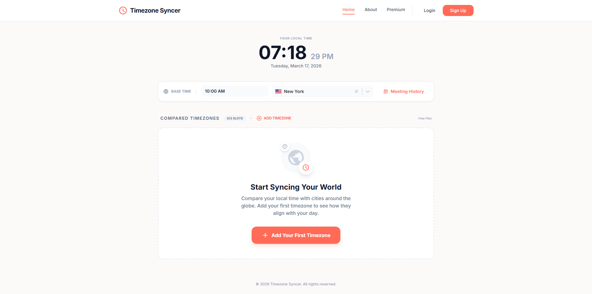
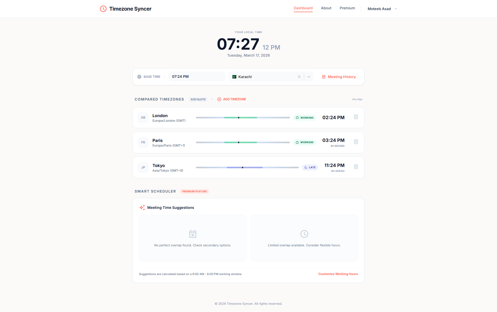
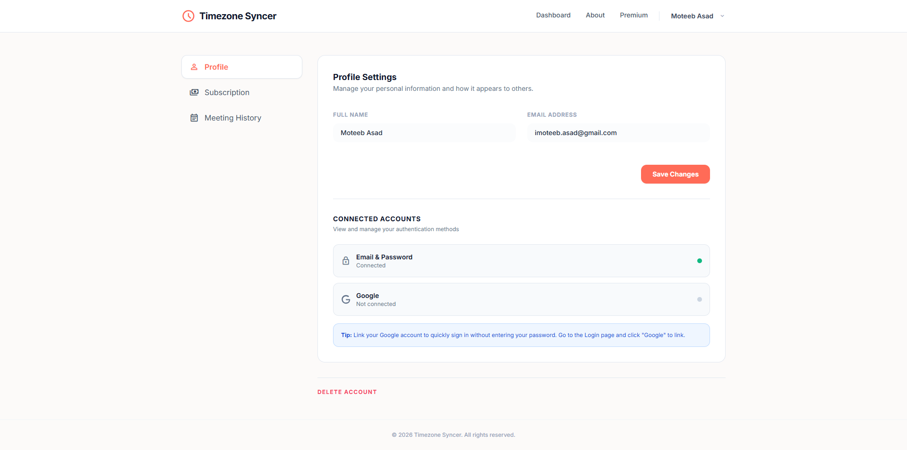
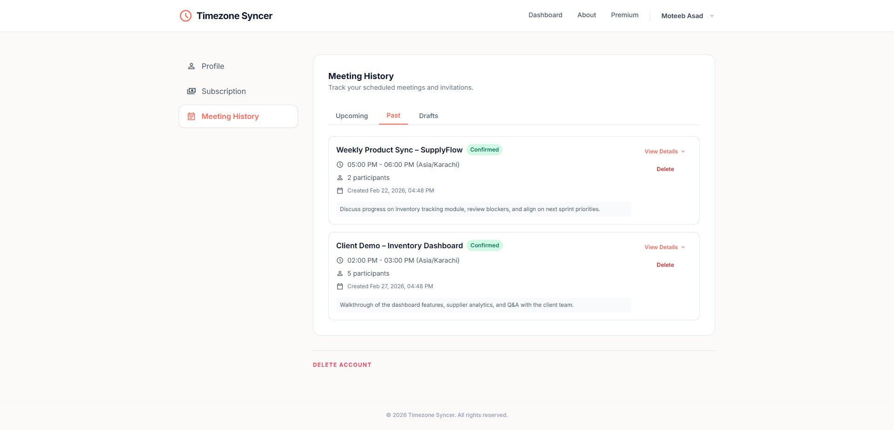

# Timezone Syncer

## Overview

Timezone Syncer is a web app for comparing multiple time zones in real time. It helps distributed teams schedule meetings and coordinate work by providing a single reference time and clear working-hours indicators across locations. This eliminates manual time conversion and reduces coordination errors.

## Problem It Solves

Distributed teams often struggle with scheduling due to time zone differences, leading to confusion, missed meetings, and inefficient coordination. Manual time conversion is error-prone and slows down collaboration.

Timezone Syncer solves this by:

- Providing a single place to compare and reference multiple time zones
- Showing working-hours status for each location
- Reducing scheduling friction and mistakes
- Supporting both free and premium usage limits

## Features

- Live time comparison across multiple time zones
- Base time reference for consistent scheduling
- Working-hours status (working, early, late)
- Meeting history and suggestions (premium)
- Authentication with Google and email/password
- Responsive layout for desktop and mobile
- Free and premium plan limits

## Screenshots

Results look like.

<p align="left" style="width:50%">
   
   
   
   
</p>

## Tech Stack

- Framework: React 19 (Vite)
- Language: TypeScript
- State: Redux Toolkit
- Routing: React Router
- Styling: Tailwind CSS
- Auth: Firebase Auth
- Timezone data: @vvo/tzdb

## Architecture

- Vite for fast development and optimized builds
- Feature-based folder structure under `src/features`
- Reusable UI components under `src/components`
- Centralized store with Redux Toolkit
- Firebase integration for authentication

## Environment Variables

Create a `.env.local` file in the project root:

```
VITE_FIREBASE_API_KEY=your_api_key
VITE_FIREBASE_AUTH_DOMAIN=your_project.firebaseapp.com
VITE_FIREBASE_PROJECT_ID=your_project_id
VITE_FIREBASE_STORAGE_BUCKET=your_project.appspot.com
VITE_FIREBASE_MESSAGING_SENDER_ID=your_sender_id
VITE_FIREBASE_APP_ID=your_app_id
```

| Variable                            | Description                  | Required |
| ----------------------------------- | ---------------------------- | -------- |
| `VITE_FIREBASE_API_KEY`             | Firebase API key             | Yes      |
| `VITE_FIREBASE_AUTH_DOMAIN`         | Firebase Auth domain         | Yes      |
| `VITE_FIREBASE_PROJECT_ID`          | Firebase project ID          | Yes      |
| `VITE_FIREBASE_STORAGE_BUCKET`      | Firebase storage bucket      | Yes      |
| `VITE_FIREBASE_MESSAGING_SENDER_ID` | Firebase messaging sender ID | Yes      |
| `VITE_FIREBASE_APP_ID`              | Firebase app ID              | Yes      |

Notes:

- Do not commit real secrets in `.env` or `.env.local`.
- For production, set variables to your deployed Firebase project.

## Authentication & Access Control

- Public pages: Home, About, Premium, Login, Signup
- Protected pages: Dashboard, Account
- Google and email/password authentication
- Free plan: up to 3 time zones
- Premium plan: higher limits and features

## Getting Started

### Prerequisites

- Node.js 20.19+
- npm
- A Firebase project with Auth enabled

### Installation

1. Clone the repository.
   ```bash
   git clone <your-repo-url>
   cd timezone-syncer
   ```
2. Install dependencies.
   ```bash
   npm install
   ```
3. Configure environment variables as above.
4. Run the development server.
   ```bash
   npm run dev
   ```
   App runs at `http://localhost:5173` by default.

### Build for Production

```bash
npm run build
npm run preview
```

## Roadmap

- Meeting time suggestions based on overlap
- Custom working hours per user
- Calendar export
- Team collections and shared views
- Dark mode
